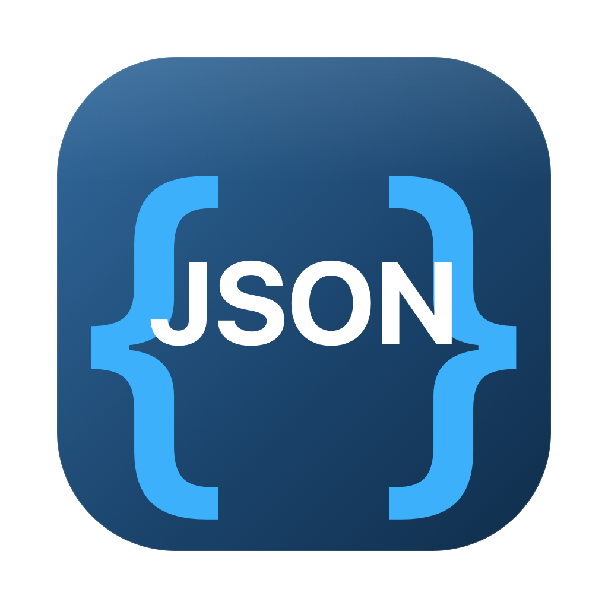

# JSON Viewer

A small, native macOS app for pasting JSON and reading it in a clean, formatted way. No browser, no runtime dependencies. It's a compiled Swift app that renders the viewer UI in a `WKWebView`.



## Features

- **Paste to format** — paste JSON on the left, get a formatted view on the right (auto-formats on paste, or press `⌘↵`).
- **Collapsible tree** with syntax highlighting, plus expand-all / collapse-all.
- **Search** keys and values (`⌘F`) with match count, next/previous navigation (`⏎` / `⇧⏎`), and a filter mode that shows only matching branches.
- **Open a file** via the toolbar button or by dragging a `.json` file onto the window.
- **Copy formatted** JSON (2-space indented) to the clipboard.
- **Dark mode** that follows the system appearance.
- Clear error messages with line/column for invalid JSON.

## Project layout

| File | What it is |
|------|------------|
| `main.swift` | The native app: window, menu, and the `WKWebView` host. |
| `ui.html` | The entire viewer UI (HTML/CSS/JS) loaded into the web view. |
| `make_icon.swift` | Renders the app icon at 1024px with CoreGraphics. |
| `Info.plist` | App bundle metadata. |
| `build.sh` | Compiles the `.app` bundle. |
| `make_dmg.sh` | Builds the app and packages a drag-to-Applications `.dmg`. |

## Build

Requires the Swift toolchain (Xcode or Command Line Tools).

```bash
# Build the .app into build/
./build.sh

# Or build the app and a distributable .dmg
./make_dmg.sh
```

## Install

Open `build/JSON Viewer.dmg` and drag the app onto the Applications shortcut.

The app is ad-hoc signed (not notarized), so on first launch right-click the app → **Open** → **Open**. After that it launches normally. If macOS blocks it as "damaged":

```bash
xattr -dr com.apple.quarantine "/Applications/JSON Viewer.app"
```

## Notes

- Universal Apple-silicon build targeting macOS 11+.
- To ship with a clean double-click launch and no Gatekeeper prompt, the build needs to be signed and notarized with a paid Apple Developer account.
